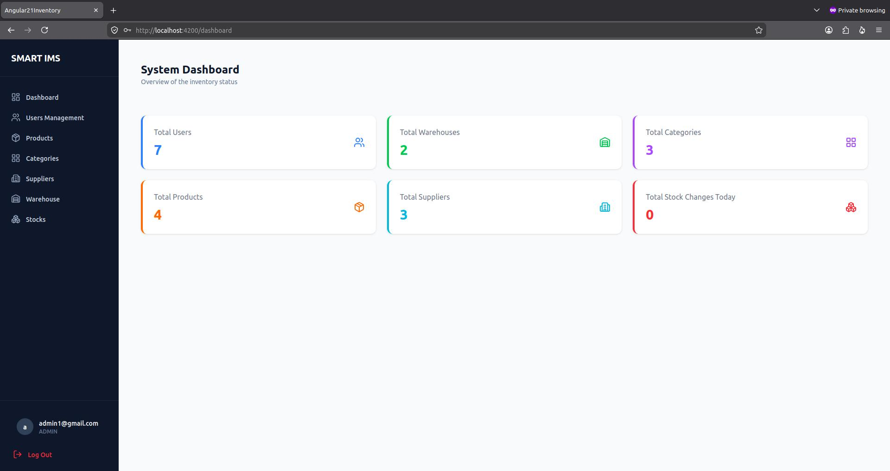
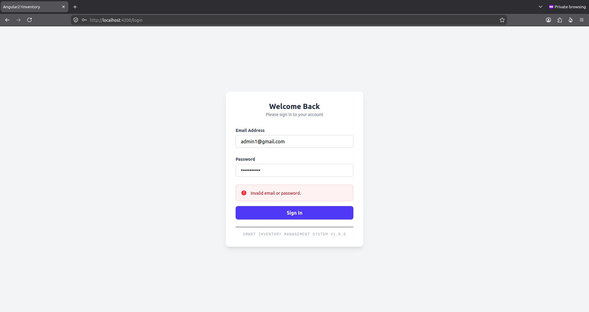
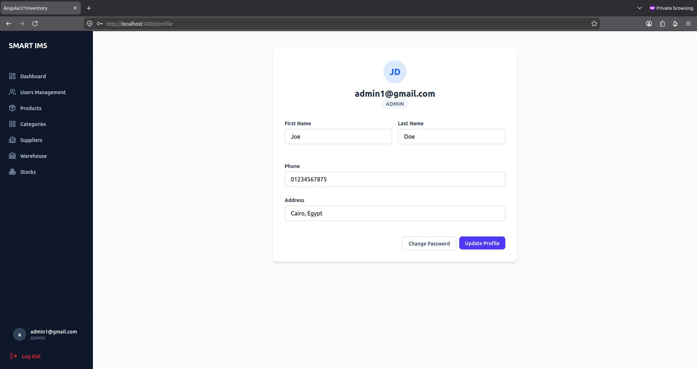
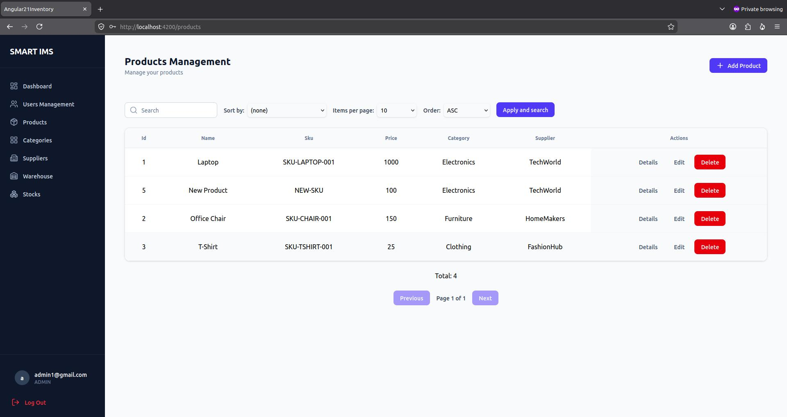
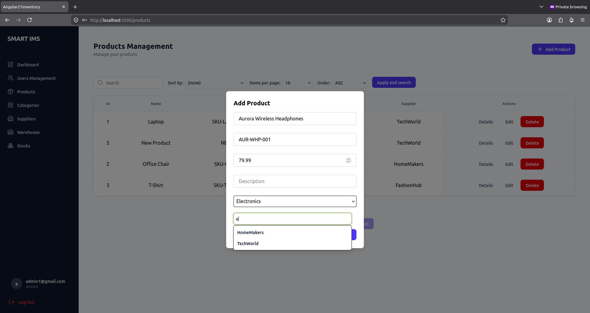
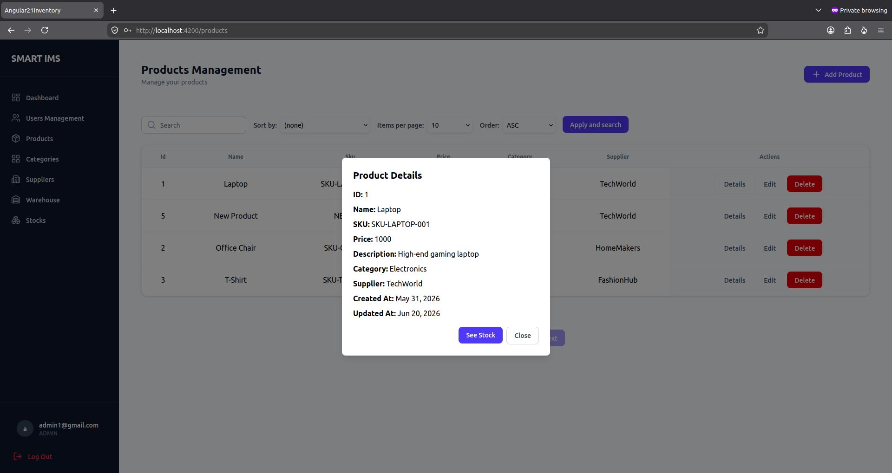
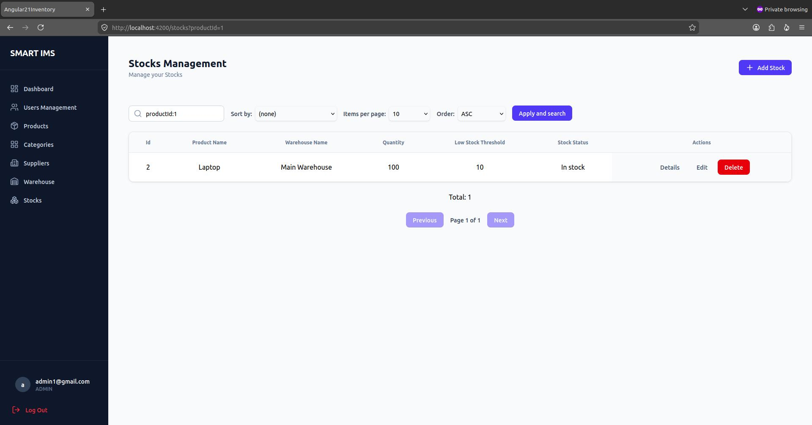

# Smart Inventory Management System

A microservices-based inventory management system built with Spring Boot, Angular, and PostgreSQL.

## Table of Contents

- [Notes](#-notes)
- [Services](#-services)
- [Screenshots](#-screenshots)

## 📝 Notes

- The source code repositories are **private**.
- This repository is intended to showcase the project's architecture, features, and demonstration.
- This project follows a microservices architecture.

## 🗂 Services

| Service | Description |
|---------|-------------|
| **API Gateway** | Routes incoming requests to the appropriate microservice and provides centralized access. |
| **User Service** | User management, authentication, authorization, and profile management. |
| **Product Service** | Product, category, and supplier management. |
| **Stock Service** | Warehouse management, stock operations, and stock transactions. |
| **Dashboard Service** | Provides inventory metrics and aggregated dashboard data. |

## 📸 Screenshots

  

  
  

  
  

  
  

